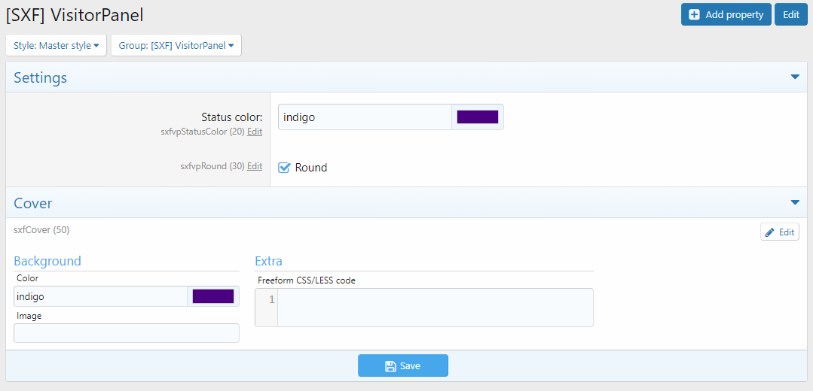

# [SXF] VisitorPanel 
## EN Description
**Description:** Widget visitor panel for XenForo 2.

**Possibilities:**
1. Shows the number of resources. (If XFRM is installed (Resource Manager));
2. Shows reactions instead of sympathies. (If [TH] Reactions is set).
3. You can set your own color and cover background in the style settings.
4. You can change the color of the status background in the style settings.
5. You can change the avatar forum (Round, Square).
## RU Description
**Описание:** Виджет панели посетителя для XenForo 2.

**Вожможности:**
1. Показывает кол-во ресурсов. (Если установлен XFRM (Ресусрс Менеджер));
2. Показывает реакции вместо симпатий. (Если установлен [TH] Reactions).
3. Можно установить свой цвет и фона кавера в настройках стиля.
4. Можно изменить цвет фона статуса в настройках стиля.
5. Можно изменить форума аватара (Круглый, Квадратный).

## Gallery

